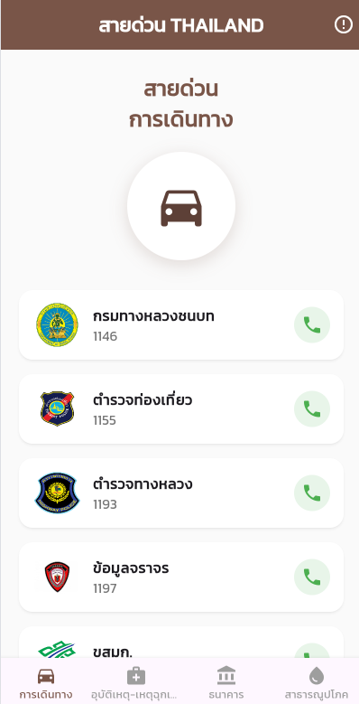
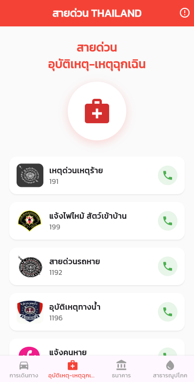
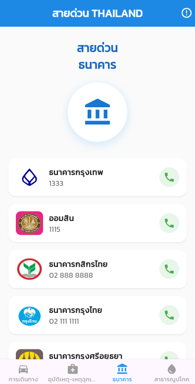
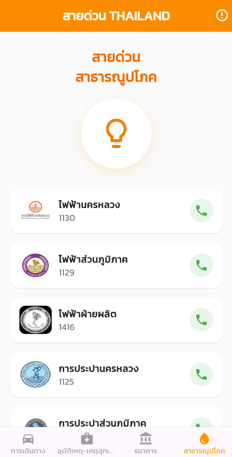

# 📱 Thai Hotline App (แอปพลิเคชันรวมเบอร์สายด่วน)

แอปพลิเคชันสำหรับรวบรวมเบอร์โทรศัพท์สายด่วนที่สำคัญในประเทศไทย แบ่งเป็น 4 หมวดหมู่ เพื่อความสะดวกและรวดเร็วในการติดต่อในยามฉุกเฉิน หรือเมื่อต้องการความช่วยเหลือ

## 🌟 ฟีเจอร์หลัก (Features)
- 🚗 **หมวดการเดินทาง:** เบอร์โทรฉุกเฉินเกี่ยวกับการเดินทาง, รถเมล์, ทางด่วน, ตำรวจทางหลวง
- 🚑 **หมวดอุบัติเหตุ-เหตุฉุกเฉิน:** แจ้งเหตุด่วนเหตุร้าย, กู้ชีพ, ดับเพลิง
- 🏦 **หมวดธนาคาร:** อายัดบัตร, สอบถามข้อมูลธนาคารต่างๆ
- 💡 **หมวดสาธารณูปโภค:** แจ้งไฟฟ้าขัดข้อง, น้ำประปา, อินเทอร์เน็ต

## 📸 ภาพตัวอย่างแอปพลิเคชัน (Screenshots)

  
  
  
  
  

---
**ผู้จัดทำ:** นาย ภควัตร เอมละออ (รหัสนักศึกษา: 6752410017)  
**คณะ:** ศิลปศาสตร์เเละวิทยาศาสตร์ | **สาขาวิชา:** การพัฒนาโปรเเกรมประยุกต์สำหรับอุปกรณ์เคลื่อนที่  
มหาวิทยาลัยเอเชียอาคเนย์

